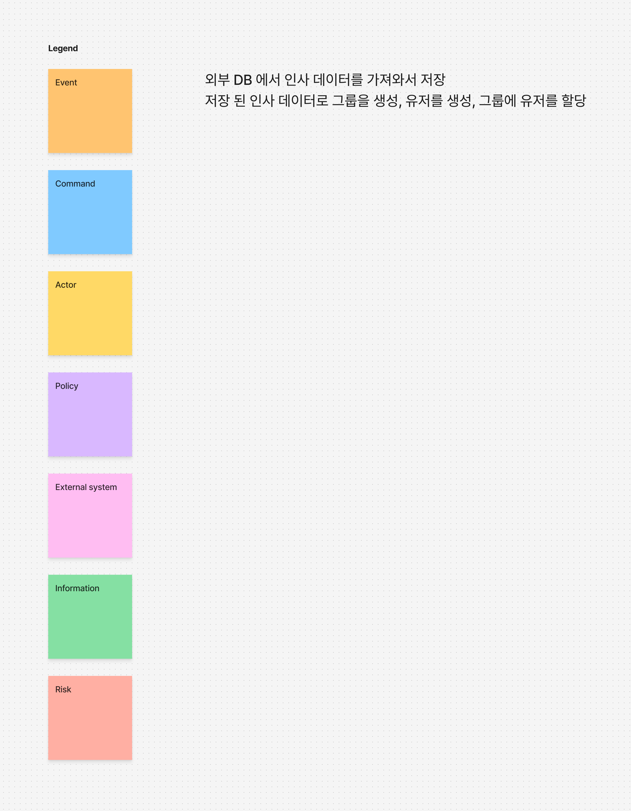
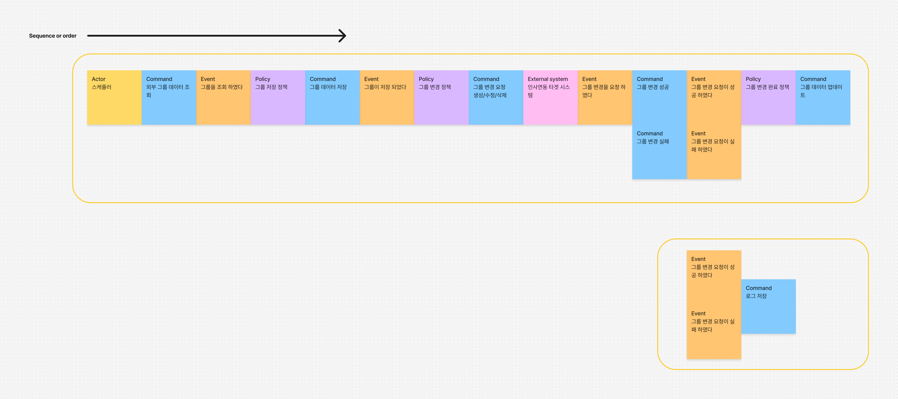

# 7장. 가속화와 관리도구

## 설계의 중요성

- 1장에서 배웠다  
- **좋은 설계의 대안은 나쁜 설계이다, 즉 설계는 선택이 아닌 필수다**
- 결혼은 선택, **설계는 필수**
- 좋은 설계를 시작하는 효과적인 기술! → **이벤트 스토밍**

---

## 이벤트 스토밍

- **Brain Storming**과 **Event**를 조합한 명칭
- 도메인 전문가와 개발자 모두가 참여하는 **신속한 설계 기술**
- 기반 지식이 필요한 도구(UML) 대신 **포스트잇**을 사용
- 지적하거나 평가하는 자리가 아니므로, **이벤트를 많이 도출할수록 좋음**
- 회당 약 2시간, 수일에 걸쳐 진행 가능
- **준비물**:
  - 회의실
  - 각 색의 포스트잇
  - 잘 보이는 펜
  - 도메인 전문가와 개발자 등 **모든 관계자**
- **실습**: 

---

## 모델링 스파이크와 모델링 부채

- 프로젝트를 시작할 땐 **이벤트 스토밍이 가장 좋음**
- 완벽해보이던 모델링도 **결국 바뀜**
- **새로운 스프린트마다 이벤트 스토밍을 멈추지 말자**
- 바쁜 일정에도 중요한 작업임을 **잊지 말자**

---

## 어떻게 구현해야 하는가?

1. 이벤트 스토밍을 통해 **구체적인 시나리오** 필요성을 깨달음
2. 도메인 전문가와 함께 **given / when / then** 형식의 시나리오 작성
3. 인수 테스트가 작성됨
4. 테스트를 만족시키며 도메인 전문가와 소통
5. 이 반복 과정을 통해 **새로운 컴포넌트가 만들어짐**

> 현실은...

- 구체적인 시나리오 없이 **빈약한 설계**로 시작
- 변경되거나 예상치 못한 정책의 충돌로 **원치 않았던 결과물** 발생
- 역시, **도메인 전문가와 이벤트 스토밍을 해야겠구만...**

---

## 도메인 전문가와 상호작용 하기

- 개발자가 원하는 결과를 만들기 위해,
- 바쁘고 바쁜 도메인 전문가에게 **이벤트 스토밍을 재밌고 유익한 시간**으로 만들어줘야 함
- 그러기 위해 **중요하고 많지만 정제된 질문**을 준비해야 함
- 도메인 전문가는 **답을 알고 있음**
- 도메인 전문가가 이 과정을 **가치있다고 느끼는 순간**
  - **선순환**을 통해 **강한 파트너십**이 형성됨

---

## Event Storming 실습

